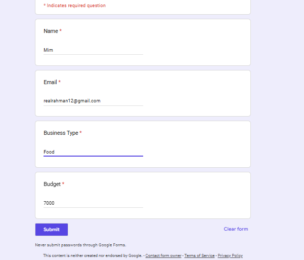
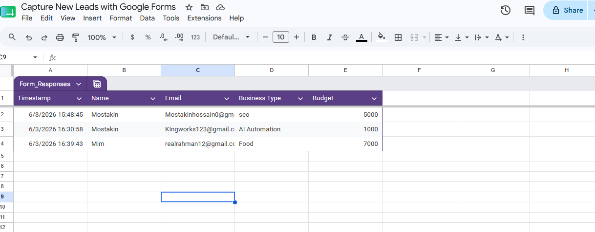
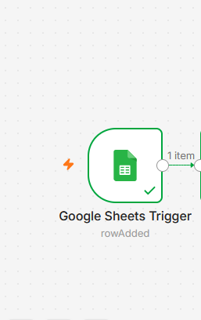
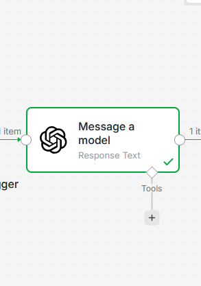
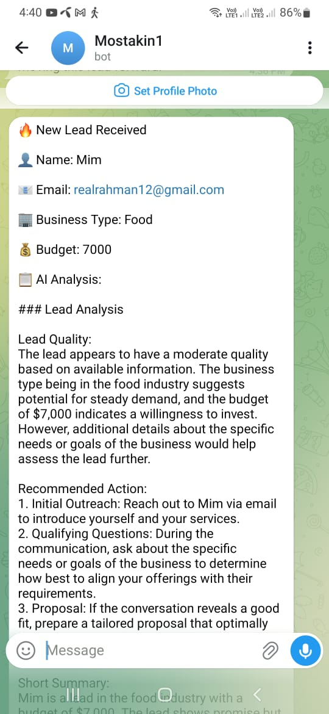
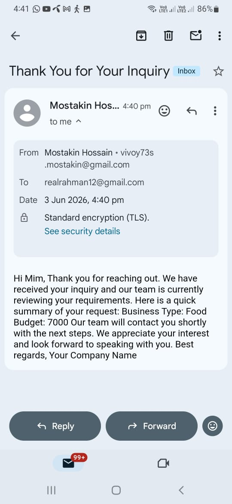
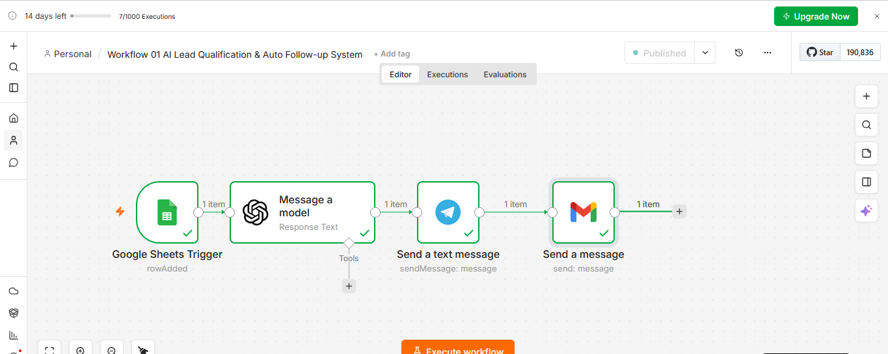

# AI Lead Qualification & Auto Follow-Up System

## Project Summary

This project was built to solve a common problem faced by many businesses: leads arrive, but follow-ups are often delayed or forgotten.

The workflow automatically captures incoming leads, reviews the information using AI, sends an instant notification to the business owner, and follows up with the lead automatically.

Instead of manually checking forms and responding to inquiries, the entire process is handled through automation.

### Core Principle

**No Lead Should Be Lost.**

---

## Business Problem

Many businesses collect leads through forms, landing pages, and websites, but struggle with:

* Slow response times
* Missed follow-ups
* Disorganized lead information
* Lost sales opportunities

A delayed response can often mean losing a potential customer.

---

## Solution

This workflow creates an automated lead management process.

When a lead submits a form:

1. The lead is stored in Google Sheets
2. The workflow starts automatically
3. AI reviews the lead information
4. A Telegram notification is sent
5. A follow-up email is delivered automatically

The result is a faster and more reliable lead handling process.

---

## Who Is This For?

* Freelancers
* Marketing Agencies
* Consultants
* Service Businesses
* Local Businesses
* SaaS Companies

Anyone who receives inquiries and wants a faster follow-up process.

---

## Business Impact

This workflow helps businesses respond faster without increasing workload.

Benefits include:

* Faster lead response
* Better organization
* Reduced manual work
* Improved customer experience
* Higher conversion opportunities

By automating repetitive tasks, businesses can focus on conversations and sales instead of administration.

---

## Skills Demonstrated

* Workflow Automation
* Lead Management Systems
* AI Integration
* Google Workspace Automation
* API Integrations
* Business Process Automation
* Client-Focused Workflow Design
* n8n Development

---

## Business Value

* Faster lead response
* Better lead organization
* Less manual work
* Improved customer experience
* More opportunities to convert leads into customers

---

## Tools Used

* n8n
* Google Forms
* Google Sheets
* OpenAI
* Telegram
* Gmail

---

## Workflow Diagram

```text
Google Form
    │
    ▼
Google Sheets
    │
    ▼
Google Sheets Trigger
    │
    ▼
AI Lead Analysis
    │
    ▼
Telegram Notification
    │
    ▼
Gmail Follow-Up
```

---

## How It Works

A potential customer fills out a form.

The lead information is automatically stored in Google Sheets, which triggers the automation workflow.

The workflow reviews the lead details, creates a quick AI-generated summary, sends an instant Telegram notification to the business owner, and automatically sends a follow-up email to the lead.

This process helps businesses respond faster, stay organized, and reduce the chances of losing potential customers.

---

## Screenshots

### Lead Capture Form



### Lead Database



### Workflow Trigger



### AI Lead Analysis



### Telegram Notification



### Automatic Follow-Up Email



### Complete Workflow



---

## Testing Results

The workflow was tested using a real lead submission collected through the Google Form.

### Test Scenario

Lead Information:

* Date: 6/3/2026 16:39:43
* Name: Mim
* Email: [realrahman12@gmail.com](mailto:realrahman12@gmail.com)
* Business Type: Food
* Budget: 7000

### Expected Result

* Lead stored in Google Sheets
* Workflow triggered automatically
* AI generated lead summary
* Telegram notification sent
* Follow-up email delivered

### Test Status

✅ Passed

The workflow completed successfully from form submission to follow-up communication. All automation steps were executed as expected.

---

## Project Outcome

This project demonstrates a complete lead management workflow built with n8n.

A new lead is captured through a form, stored in a database, reviewed automatically, and followed up without manual effort.

The workflow helps businesses respond faster, stay organized, and reduce the risk of losing potential customers.

The core idea behind this project is simple:

**No Lead Should Be Lost.**
## Project Pricing Estimate

This project demonstrates a complete AI-powered lead qualification and follow-up automation system built with n8n.

### Starter Package

Includes:

* Google Form Integration
* Google Sheets Integration
* Lead Storage
* Telegram Notification

Estimated Project Value: **$50**

### Standard Package

Includes:

* Google Form Integration
* Google Sheets Integration
* AI Lead Qualification
* Telegram Notification
* Automatic Follow-Up Email

Estimated Project Value: **$100 - $150**

### Premium Package

Includes:

* Everything in Standard
* Advanced AI Prompt Customization
* Additional Integrations
* Extended Documentation
* Custom Business Logic

Estimated Project Value: **$200 - $300**

## Ongoing Costs

This workflow does not require a monthly maintenance fee in most cases.

Possible recurring costs:

* OpenAI API: Approximately $1 - $10/month depending on usage
* Optional third-party services if added by the client
